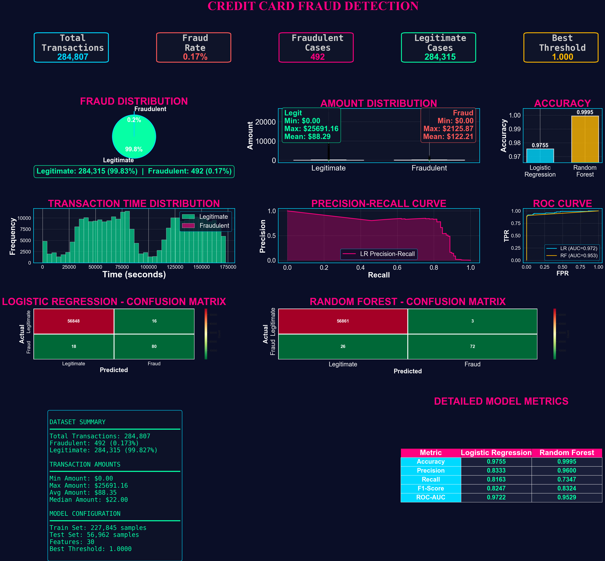

<H1 align="center"> 🔥🔥CODSOFT 🔥🔥 </H1>

<p align="center">
  <a  href="https://github.com/rohitsinghsomvanshi/CODSOFT/blob/main/CreditCard_Proj/Credit_fraud.ipynb" align="center"> Click Me </a>
  </p>

# 💳 Credit Card Fraud Detection Dashboard

A complete **Machine Learning & Data Visualization** project that detects fraudulent credit card transactions using **Logistic Regression** and **Random Forest**. The project includes an interactive dashboard with model comparison, performance metrics, fraud analysis, and visual insights.

---

## 📌 Project Overview

Credit card fraud is one of the biggest challenges in the financial industry. This project uses machine learning algorithms to identify fraudulent transactions and compares their performance using various evaluation metrics.

The dashboard provides:

- 📊 Fraud vs Legitimate Transaction Analysis
- 📈 Transaction Amount Distribution
- ⏰ Transaction Time Distribution
- 🎯 Accuracy Comparison
- 📉 Precision-Recall Curve
- 📈 ROC Curve
- 🔥 Confusion Matrices
- 📋 Detailed Performance Metrics
- 📦 Dataset Summary

---

## 📷 Dashboard Preview




---

# 🚀 Features

- Data Cleaning & Preprocessing
- Fraud Detection using Machine Learning
- Logistic Regression Model
- Random Forest Classifier
- Model Performance Comparison
- Interactive Dashboard
- Beautiful Data Visualizations
- ROC & Precision-Recall Analysis
- Confusion Matrix Comparison

---

# 📂 Dataset Information

- **Total Transactions:** 284,807
- **Fraudulent Transactions:** 492
- **Legitimate Transactions:** 284,315
- **Fraud Rate:** 0.17%

Dataset contains **30 features** after preprocessing.

---

# 🛠️ Technologies Used

- Python
- Pandas
- NumPy
- Matplotlib
- Seaborn
- Scikit-learn
- Plotly (Optional)
- Jupyter Notebook

---

# 🤖 Machine Learning Models

## Logistic Regression

- Accuracy: **97.55%**
- Precision: **83.33%**
- Recall: **81.63%**
- F1 Score: **82.47%**
- ROC-AUC: **97.22%**

---

## Random Forest

- Accuracy: **99.95%**
- Precision: **96.00%**
- Recall: **73.47%**
- F1 Score: **83.24%**
- ROC-AUC: **95.29%**

---

# 📊 Dashboard Components

✔ Total Transactions

✔ Fraud Rate

✔ Fraudulent Cases

✔ Legitimate Cases

✔ Fraud Distribution

✔ Amount Distribution

✔ Accuracy Comparison

✔ Transaction Time Distribution

✔ Precision-Recall Curve

✔ ROC Curve

✔ Logistic Regression Confusion Matrix

✔ Random Forest Confusion Matrix

✔ Detailed Model Metrics

✔ Dataset Summary

---

# 📈 Model Evaluation Metrics

| Metric | Logistic Regression | Random Forest |
|---------|--------------------|---------------|
| Accuracy | 97.55% | 99.95% |
| Precision | 83.33% | 96.00% |
| Recall | 81.63% | 73.47% |
| F1 Score | 82.47% | 83.24% |
| ROC-AUC | 97.22% | 95.29% |

---

# 📁 Project Structure

```
Credit-Card-Fraud-Detection/
│
├── Dataset/
│   └── creditcard.csv
│
├── Images/
│   └── dashboard.png
│
├── Notebook/
│   └── Fraud_Detection.ipynb
│
├── README.md
│
└── requirements.txt
```

---

# ⚙ Installation

Clone the repository

```bash
git clone https://github.com/yourusername/Credit-Card-Fraud-Detection.git
```

Go to project folder

```bash
cd Credit-Card-Fraud-Detection
```

Install dependencies

```bash
pip install -r requirements.txt
```

Run Jupyter Notebook

```bash
jupyter notebook
```

---

# 📌 Future Improvements

- Deep Learning Models
- XGBoost Implementation
- LightGBM
- Streamlit Web App
- Real-Time Fraud Detection
- Hyperparameter Tuning

---

# 📚 Learning Outcomes

This project demonstrates:

- Data Preprocessing
- Exploratory Data Analysis (EDA)
- Classification Algorithms
- Handling Imbalanced Data
- Performance Evaluation
- Dashboard Design
- Machine Learning Workflow

---

# 👨‍💻 Author

**Rohit Singh**

📧 Email: rohitsinghsomvanci00@gmail.com

🔗 Portfolio: [https://github.com/rohitsinghsomvanshi](https://rohitsinghsomvanshi.github.io/Portfolio/)

💼 LinkedIn: https://linkedin.com/in/rohitsinghsomvanshi

---

# ⭐ If you like this project, don't forget to Star the repository!
