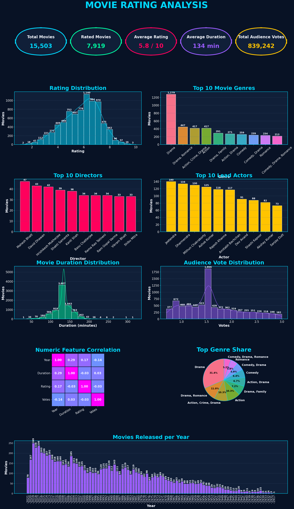

<h1 align = "center">🔥🔥CODSOFT🔥🔥</h1>
<p align="center">
  <a  href="https://github.com/rohitsinghsomvanshi/CODSOFT/blob/main/Movie_Rating_Proj/mov_rating.ipynb" align="center"> Click Me </a>
  </p>


# 🎬 Movie Rating Analysis Dashboard

A complete Exploratory Data Analysis (EDA) project built using **Python**, **Pandas**, **Matplotlib**, and **Seaborn** to analyze movie ratings, genres, directors, actors, audience votes, and release trends.

---

## 📌 Project Overview

This project analyzes a movie dataset containing information about ratings, genres, directors, actors, movie duration, audience votes, and release years.

The dashboard provides meaningful insights into movie trends and audience preferences through interactive visualizations.

---

## 📊 Dashboard Preview

<p align="center">

</p>

**Key Performance Indicators (KPIs)**

- 🎥 Total Movies: **15,503**
- ⭐ Rated Movies: **7,919**
- ⭐ Average Rating: **5.8 / 10**
- ⏱ Average Duration: **134 Minutes**
- 👥 Total Audience Votes: **839,242**

---

## 📈 Visualizations Included

### 1. Rating Distribution
- Distribution of movie ratings
- Most movies are rated between **5 and 7**

### 2. Top 10 Movie Genres
- Most popular movie genres
- Genre frequency comparison

### 3. Top 10 Directors
- Directors with the highest number of movies

### 4. Top 10 Lead Actors
- Actors appearing in the largest number of movies

### 5. Movie Duration Distribution
- Analysis of movie runtime
- Most movies are around **120–150 minutes**

### 6. Audience Vote Distribution
- Distribution of audience votes across movies

### 7. Correlation Heatmap
Shows correlation between:
- Year
- Duration
- Rating
- Votes

### 8. Genre Share (Pie Chart)
Percentage contribution of the top movie genres.

### 9. Movies Released Per Year
Trend of movie releases over different years.

---

# 🛠 Technologies Used

- Python
- Pandas
- NumPy
- Matplotlib
- Seaborn
- Jupyter Notebook

---

# 📂 Project Structure

```
Movie-Rating-Analysis/
│
├── dataset/
│   └── movies.csv
│
├── images/
│   └── dashboard.png
│
├── notebooks/
│   └── Movie_Rating_Analysis.ipynb
│
├── README.md
│
└── requirements.txt
```

---

# 📦 Python Libraries

```python
pandas
numpy
matplotlib
seaborn
```

Install dependencies:

```bash
pip install -r requirements.txt
```

or

```bash
pip install pandas numpy matplotlib seaborn
```

---

# 🚀 How to Run

1. Clone this repository

```bash
git clone https://github.com/your-username/Movie-Rating-Analysis.git
```

2. Open the project folder

```bash
cd Movie-Rating-Analysis
```

3. Install required libraries

```bash
pip install -r requirements.txt
```

4. Run the Jupyter Notebook

```bash
jupyter notebook
```

---

# 📊 Key Insights

- Average movie rating is **5.8/10**
- Average movie duration is **134 minutes**
- Drama is the most common movie genre.
- Most movies have ratings between **5 and 7**.
- The majority of movies are approximately **120–150 minutes** long.
- Certain directors and actors dominate the dataset with significantly more movie appearances.
- Weak correlation exists between rating, votes, duration, and release year.

---

# 📚 Skills Demonstrated

- Data Cleaning
- Exploratory Data Analysis (EDA)
- Data Visualization
- Statistical Analysis
- Dashboard Design
- Python Programming
- Business Insights
- Matplotlib Customization
- Seaborn Visualization

---

# 🎯 Future Improvements

- Interactive dashboard using Plotly
- Power BI dashboard version
- Streamlit web application
- Genre-wise filtering
- Year-wise filtering
- Search functionality

---

# 👨‍💻 Author

**Rohit Singh**

📧 Email: your-email@example.com

🔗 LinkedIn: https://linkedin.com/in/your-profile

💻 GitHub: https://github.com/your-username

---

## ⭐ If you found this project helpful, don't forget to Star this repository!
