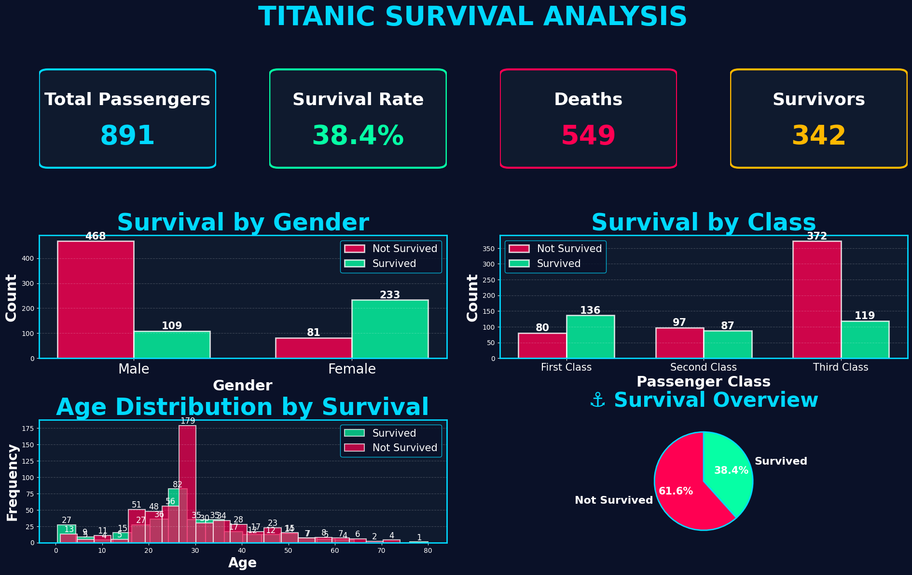

# <h1 align ="center"> 🔥🔥 CODSOFT 🔥🔥 </h1>
 <p align="center"> 
  <a  href="https://github.com/rohitsinghsomvanshi/CODSOFT/blob/main/Titanic_Proj/tytanic.ipynb" target="blank" align="center"> Click Me </a>
  </p>
  
#  🚢 Titanic Survival Prediction Dashboard 
<p align="center">

</p>

A Machine Learning project that predicts passenger survival on the Titanic dataset and presents the analysis using a beautiful interactive dashboard built with Python, Pandas, Matplotlib, Seaborn, and Scikit-learn.

---


## 📌 Project Overview

This project performs:

- Data Loading
- Data Cleaning
- Missing Value Handling
- Feature Engineering
- Data Visualization
- Machine Learning Model Training
- Model Evaluation
- Professional Dashboard Creation

---

## 🛠 Technologies Used

- Python
- NumPy
- Pandas
- Matplotlib
- Seaborn
- Scikit-learn

---

## 📂 Dataset

Dataset Used:

**Titanic Dataset (CSV)**

Columns include:

- PassengerId
- Survived
- Pclass
- Name
- Sex
- Age
- SibSp
- Parch
- Ticket
- Fare
- Cabin
- Embarked

---

## 📊 Data Preprocessing

The following preprocessing steps are performed:

- Remove Cabin column
- Fill missing Age values
- Fill missing Embarked values
- Convert Gender into numerical values
- One-Hot Encoding for Embarked
- Remove unnecessary columns
- Split dataset into Training and Testing data

---

## 🤖 Machine Learning Models

Two models are trained:

### 1. Logistic Regression

Used for binary classification.

### 2. Random Forest Classifier

Used to improve prediction accuracy.

---

## 📈 Model Evaluation

Evaluation metrics used:

- Accuracy Score
- Classification Report
- Confusion Matrix

---

# 📊 Dashboard Features

The dashboard contains:

✅ Total Passengers KPI

✅ Total Survivors KPI

✅ Survival Rate KPI

✅ Survival Count Bar Chart

✅ Survivors by Gender Pie Chart

✅ Survival by Passenger Class Count Plot

✅ Age Distribution Histogram

---

## 📷 Dashboard Preview

The dashboard includes:

- Modern Gradient Background
- KPI Cards
- Stylish Charts
- Professional Layout
- Colorful Visualizations

---

## 📦 Required Libraries

Install dependencies:

```bash
pip install numpy pandas matplotlib seaborn scikit-learn
```

---

## ▶️ How to Run

Clone the repository:

```bash
git clone https://github.com/yourusername/titanic-dashboard.git
```

Go to project folder:

```bash
cd titanic-dashboard
```

Run:

```bash
python titanic_dashboard.py
```

---

## 📁 Project Structure

```
Titanic-Survival-Dashboard/
│
├── titanic_c.csv
├── titanic_dashboard.py
├── README.md
└── dashboard.png
```

---

## 🎯 Project Outcome

✔ Data Cleaning

✔ Feature Engineering

✔ Machine Learning Prediction

✔ Logistic Regression

✔ Random Forest Classifier

✔ Dashboard Visualization

✔ Model Performance Evaluation

---

## 📚 Future Improvements

- Streamlit Web App
- Interactive Plotly Dashboard
- Hyperparameter Tuning
- Model Deployment
- Live Prediction Interface

---

## 👨‍💻 Author

**Rohit Singh**

MCA Student

Aspiring Data Analyst | Python Developer | Machine Learning Enthusiast

---

## ⭐ If you like this project

Give this repository a ⭐ on GitHub.
